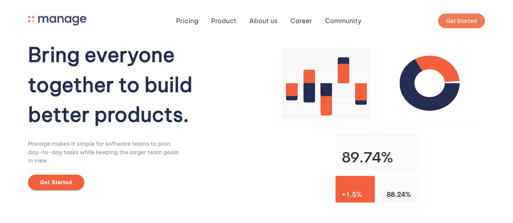

# Frontend Mentor - Manage landing page solution

This is a solution to the [Manage landing page challenge on Frontend Mentor](https://www.frontendmentor.io/challenges/manage-landing-page-SLXqC6P5). Frontend Mentor challenges help you improve your coding skills by building realistic projects. 

## Table of contents

- [Overview](#overview)
  - [The challenge](#the-challenge)
  - [Screenshot](#screenshot)
  - [Links](#links)
- [My process](#my-process)
  - [Built with](#built-with)
  - [Continued development](#continued-development)
  - [Useful resources](#useful-resources)
- [Author](#author)

## Overview

### The challenge

Users should be able to:

- View the optimal layout for the site depending on their device's screen size
- See hover states for all interactive elements on the page
- See all testimonials in a horizontal slider

### Screenshot

### Links

- Solution URL: [Repository](https://github.com/lamba01/Manage-Landing-Page)
- Live Site URL: [Live site](https://managelandingpager.netlify.app/)

## My process

### Built with

- [React](https://reactjs.org/) - JS library
- [Material UI](https://mui.com/) - For styles

### Continued development

In future projects ill be working with material ui a react library becuase it is easier and saves time and with maintainable code.

### Useful resources

- [MUI](https://mui.com/material-ui/getting-started/) - This helped me select whatever i needed and how to edit it to my project needs.
- [MUI theme](https://mui.com/material-ui/customization/default-theme/) - This is an amazing article which helped me know what the default theme for each item in material ui are and how to customize to align with my project needs.

## Author

- Website - [John Oluwafemi](https://johnsportfolioo.netlify.app/)
- Frontend Mentor - [@lamba01](https://www.frontendmentor.io/profile/lamba01)
- Twitter - [@lambacodes](https://www.twitter.com/lambacodes)
